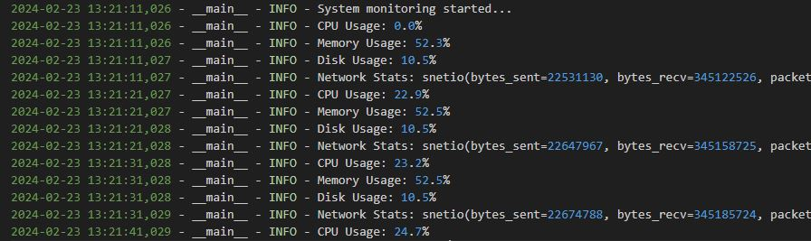
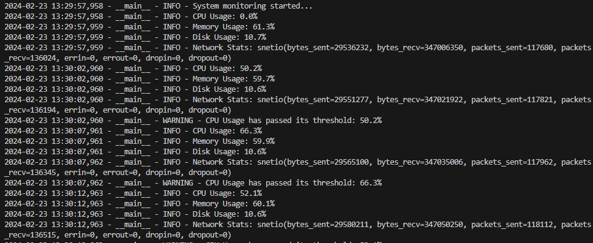

# Node-Monitoring-Tool-with-Push-Notifications
Python application for monitoring nodes, collecting alerts, notifications, and logs, and analyzing them to provide notifications in the console.


### Implementation
Run 
```
python node_monitor.py
```

